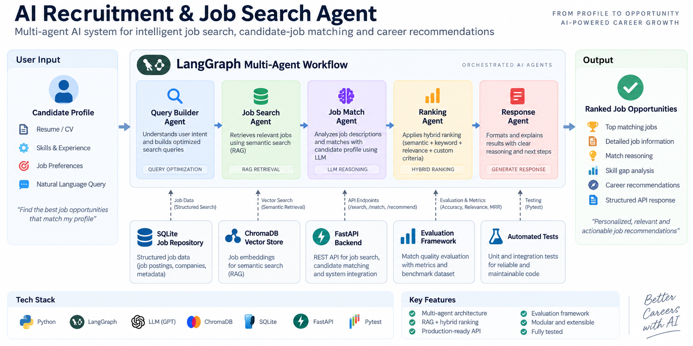
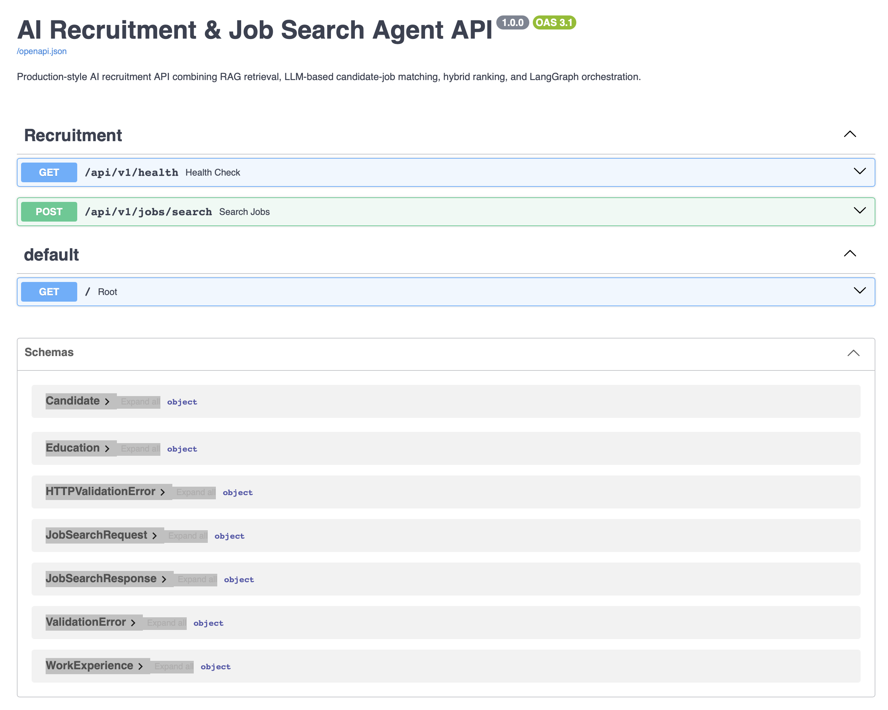

# 🤖 AI Recruitment & Job Search Agent

A production-style **AI recruitment and intelligent job-search system** that uses **RAG retrieval, LLM-based candidate–job matching, hybrid ranking, LangGraph orchestration, FastAPI, and automated evaluation** to identify and rank relevant job opportunities for a candidate.

The project demonstrates how modern AI engineering components can be combined into an end-to-end agentic workflow.

---

## 🚀 Overview

Traditional job-search systems mostly rely on keyword matching.

This project takes a more intelligent approach:

1. Understand the candidate profile
2. Retrieve semantically relevant jobs using RAG
3. Evaluate candidate–job compatibility with an LLM
4. Combine semantic retrieval and LLM matching scores
5. Rank the strongest opportunities
6. Expose the workflow through a REST API
7. Evaluate retrieval and ranking quality with measurable metrics

The complete workflow is orchestrated using **LangGraph**.

---

## 🧠 System Architecture

```text
Candidate Profile
       │
       ▼
┌─────────────────────┐
│   Retrieval Agent   │
│   Semantic / RAG    │
└──────────┬──────────┘
           │
           ▼
┌─────────────────────┐
│   Matching Agent    │
│    LLM Evaluation   │
└──────────┬──────────┘
           │
           ▼
┌─────────────────────┐
│   Ranking Agent     │
│   Hybrid Scoring    │
└──────────┬──────────┘
           │
           ▼
    Ranked Job Matches
           │
           ▼
┌─────────────────────┐
│      FastAPI        │
│      REST API       │
└─────────────────────┘
```

### LangGraph Workflow

```text
START
  │
  ▼
Retrieval Node
  │
  ▼
Matching Node
  │
  ▼
Ranking Node
  │
  ▼
END
```

Each stage updates a shared recruitment state, making the workflow explicit, modular, and easy to extend.

---
## 🏗️ System Architecture

The system uses a multi-agent LangGraph workflow to transform a candidate profile into ranked job opportunities through semantic retrieval, LLM-based matching, and hybrid ranking.



### 🔄 Recruitment Pipeline

**Candidate Profile → Query Builder → RAG Retrieval → LLM Matching → Hybrid Ranking → Ranked Job Opportunities**

The architecture combines:

- **LangGraph** for multi-agent workflow orchestration
- **ChromaDB** for vector search and RAG retrieval
- **LLM** for candidate-job reasoning and matching
- **Hybrid Ranking** for combining semantic and matching signals
- **SQLite** for structured job storage
- **FastAPI** for production-ready API endpoints
- **Evaluation Framework** for retrieval and recommendation metrics
- **Pytest** for automated unit and integration testing

---

## 🚀 API

The recruitment workflow is exposed through a FastAPI REST API and includes interactive OpenAPI/Swagger documentation.


---

## ✨ Key Features

### 🔎 RAG-Based Job Retrieval

Candidate information such as:

- target roles
- technical skills
- professional experience
- preferred location

is transformed into a semantic search query.

Relevant jobs are retrieved before expensive LLM evaluation takes place.

This reduces unnecessary model calls and improves the quality of candidate–job matching.

### 🧠 LLM Candidate–Job Matching

Retrieved jobs are evaluated using an LLM to estimate candidate compatibility.

The matching layer can reason about factors such as:

- skill alignment
- role relevance
- experience alignment
- job requirements
- candidate strengths

The result includes a structured matching score and recommendation.

### 📊 Hybrid Ranking

The final ranking does not rely exclusively on either embeddings or the LLM.

Instead, the system combines:

```text
Semantic Retrieval Score
          +
LLM Candidate Match Score
          │
          ▼
   Final Hybrid Score
```

This creates a more robust ranking pipeline.

### 🕸️ LangGraph Orchestration

The recruitment workflow is implemented as a graph-based AI system.

LangGraph coordinates:

```text
Retrieval → Matching → Ranking
```

while maintaining shared state across the workflow.

### ⚡ FastAPI REST API

The complete recruitment workflow is exposed through FastAPI.

Main endpoints:

```text
GET  /api/v1/health
POST /api/v1/jobs/search
```

Interactive API documentation is automatically available through Swagger UI.

### 🧪 Evaluation Framework

The project includes an evaluation pipeline for measuring retrieval and ranking quality.

Metrics include:

- **Recall@3**
- **Hit Rate@1**
- **Mean Reciprocal Rank (MRR)**
- **Recommendation Accuracy**

Example evaluation run:

```text
Cases: 4/4 successful
Recall@3: 100.00%
Hit Rate@1: 75.00%
Mean Reciprocal Rank: 87.50%
Recommendation Accuracy: 100.00%
```

These results are based on the included small evaluation dataset and are intended as engineering validation rather than production benchmark claims.

### ✅ Automated Tests

The project includes tests for:

- API endpoints
- RAG retrieval
- job filtering
- job repository
- hybrid ranking

Current test suite:

```text
6 passed
```

---

## 🛠️ Tech Stack

| Technology | Purpose |
|---|---|
| Python | Core application |
| LangGraph | Agent workflow orchestration |
| OpenAI-compatible LLM API | Candidate–job reasoning |
| ChromaDB | Vector retrieval |
| Sentence Transformers | Semantic embeddings |
| FastAPI | REST API |
| Pydantic | Data validation and schemas |
| Pytest | Automated testing |

---

## 📁 Project Structure

```text
ai-recruitment-job-search-agent/
│
├── app/
│   ├── agents/
│   │   └── ...
│   │
│   ├── api/
│   │   └── ...
│   │
│   ├── core/
│   │   └── ...
│   │
│   ├── database/
│   │   └── ...
│   │
│   ├── evaluation/
│   │   └── ...
│   │
│   ├── graph/
│   │   ├── __init__.py
│   │   ├── nodes.py
│   │   ├── recruitment_graph.py
│   │   └── state.py
│   │
│   └── models/
│       └── ...
│
├── data/
│   └── evaluation/
│       ├── job_match_cases.json
│       └── evaluation_report.json
│
├── tests/
│   ├── test_api.py
│   ├── test_hybrid_ranking.py
│   ├── test_job_filter_service.py
│   ├── test_job_repository.py
│   └── test_rag_retrieval.py
│
├── .env.example
├── .gitignore
├── requirements.txt
└── README.md
```

---

## ⚙️ Installation

### 1. Clone the repository

```bash
git clone <your-repository-url>
cd ai-recruitment-job-search-agent
```

### 2. Create a virtual environment

```bash
python3 -m venv .venv
```

Activate it on macOS/Linux:

```bash
source .venv/bin/activate
```

On Windows:

```bash
.venv\Scripts\activate
```

### 3. Install dependencies

```bash
python3 -m pip install -r requirements.txt
```

### 4. Configure environment variables

Copy the example environment file:

```bash
cp .env.example .env
```

Then add your API key to `.env`:

```env
GROQ_API_KEY=your_api_key_here
```

Never commit the real `.env` file.

---

## ▶️ Run the API

Start the FastAPI server:

```bash
python3 -m uvicorn app.api.main:app --reload
```

Then open the interactive API documentation:

```text
http://127.0.0.1:8000/docs
```

---

## 🔍 Example Job Search Request

Use:

```text
POST /api/v1/jobs/search
```

Example request:

```json
{
  "candidate": {
    "candidate_id": "CAND-001",
    "name": "Demo Candidate",
    "headline": "AI Engineer | Generative AI | AI Agents",
    "location": "Europe",
    "skills": [
      "Python",
      "Generative AI",
      "AI Agents",
      "RAG",
      "LLMs",
      "Azure",
      "LangGraph"
    ],
    "target_roles": [
      "AI Engineer",
      "Generative AI Engineer",
      "AI Agent Engineer"
    ]
  },
  "top_k": 5
}
```

The system processes the candidate through the complete AI workflow and returns ranked job matches.

---

## 🧪 Run Tests

Run the complete test suite:

```bash
python3 -m pytest tests/ -v
```

Example:

```text
6 passed
```

---

## 📈 Run Evaluation

Run the recruitment evaluation framework:

```bash
python3 -m app.evaluation.report
```

Example output:

```text
=== AI RECRUITMENT EVALUATION REPORT ===

Cases: 4/4 successful
Recall@3: 100.00%
Hit Rate@1: 75.00%
Mean Reciprocal Rank: 87.50%
Recommendation Accuracy: 100.00%
```

The generated report is stored under:

```text
data/evaluation/evaluation_report.json
```

---

## 🔐 Security

Sensitive credentials are loaded through environment variables.

The repository excludes:

```text
.env
.venv/
__pycache__/
.pytest_cache/
local database files
```

An `.env.example` file documents the required configuration without exposing private credentials.

---

## 🧩 Engineering Concepts Demonstrated

This project demonstrates practical implementation of:

- Agentic AI workflows
- Retrieval-Augmented Generation (RAG)
- Semantic retrieval
- Vector databases
- LLM structured reasoning
- Hybrid ranking systems
- LangGraph state management
- REST API design
- Pydantic validation
- AI evaluation metrics
- Automated testing
- Modular Python architecture

---

## 🔮 Possible Future Improvements

Potential extensions include:

- Live job-board integrations
- Resume/PDF ingestion
- candidate profile extraction
- persistent production database
- asynchronous LLM evaluation
- reranking models
- human-in-the-loop review
- observability and tracing
- Docker deployment
- cloud deployment
- authentication and rate limiting

---

## 📌 Project Purpose

This project was built as an **AI Engineering portfolio project** to demonstrate the architecture and implementation of a multi-stage intelligent recruitment system rather than a simple LLM wrapper.

The focus is on combining retrieval, reasoning, ranking, orchestration, APIs, evaluation, and testing into one maintainable AI application.

---

## 👤 Author

**Milad Sharifinia**

AI Engineering • Generative AI • AI Agents • RAG • Azure

GitHub: `@miliufo`